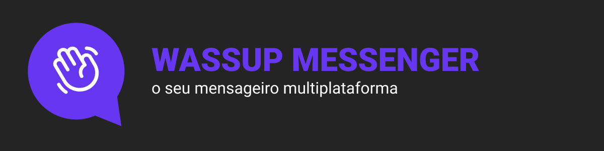
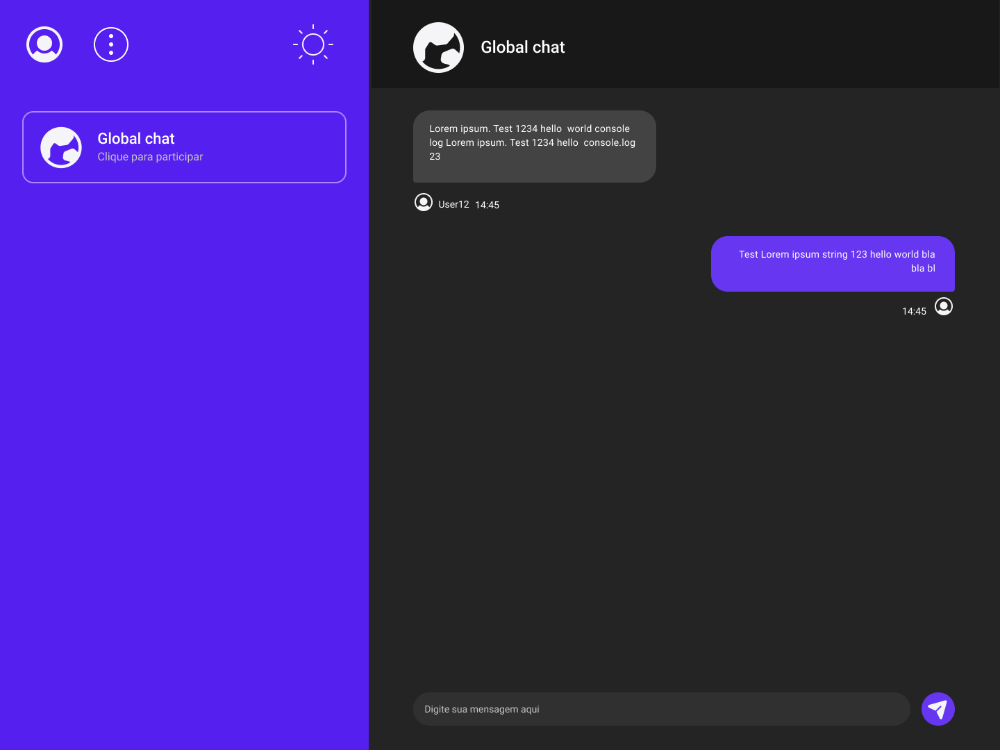

<h1 align="center">
  
</h1>

<h2> O que é esse projeto? </h2>

 
  Wassup Messenger é um mensageiro multiplataforma (mobile e web). Através dele
  é possível se conectar ao chat da plataforma e conversar com os usuários da
  plataforma, basta apenas possuir uma conta. Confira a versão mobile <a href="https://github.com/Th-Fernandes/Wassup-messenger-mobile">aqui</a>

  

  <h2>Ferramentas utilizadas (versão Web)</h2>
  <ul>
    <li>Next.js</li>
    <li>Typescript</li>
    <li>Tailwind</li>
    <li>Supabase</li>
    <li>Phosphor</li>
  </ul>

  <h2>Como utilizar</h2>
  <ol>
    <li>Cadastre seu e-mail</li>
    <li>Confirme seu cadastro com e-mail que será enviado ao mesmo</li>
    <li>Envie e receba mensagens em tempo real de outros usuários</li>
  </ol>

## Autor

