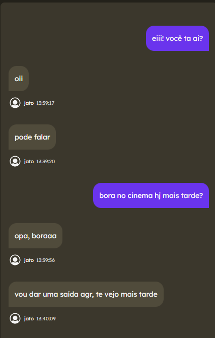
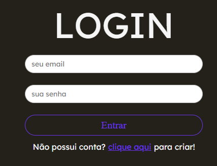

  

<h1 align="center">Wassup Messenger</h1>

Um mensageiro para a web.

<h3 align="center"> 
  
  
</h3>

# O que é esse projeto?

- Wassup Messenger é um mensageiro para a web, em tempo real e  responsivo.
- autenticações através do e-mail. 

 

  

# Como utilizar?

Basta entrar nessa [url](https://https://wassup-messenger.vercel.app/), criar sua conta, confirmá-la através do e-mail e pronto! Após essa etapa, você será redirecionado ao chat.

  

# Tecnologias e ferramentas utilizadas

- Next.js
- supabase (database e realTime)
- Phosphor

# Autor

- LinkedIn: [@thiago-fernandes-front](https://https://www.linkedin.com/in/thiago-fernandes-front/)
- Instagram: [@thiagofernandes77](https://www.instagram.com/thiagofernades77/) (com conteúdos de programação)